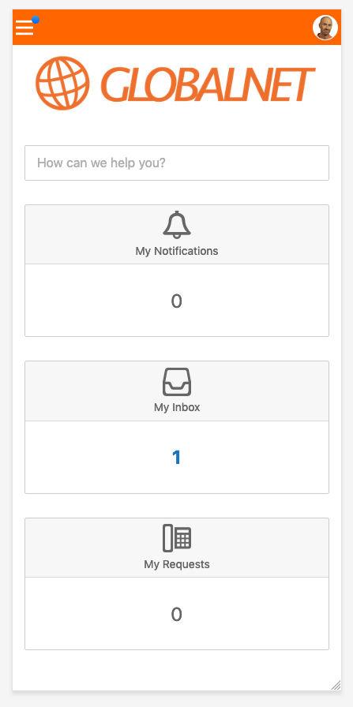

# Exercise 1: Bootstrap

## The Default Self Service Design

Go to https://4me-demo.com and log in to your demo instance.

Next, choose the GlobalNet account, or go to https://globalnet.4me-demo.com.
Log in as `frederic.anderson@globalnet.com`.

> Note: the password of all users in the demo environment is `4me`.

Once you are logged in, go to https://globalnet.4me-demo.com/self-service.
This is Self Service as it looks out of the box, without any customization. 
It is intentionally kept very basic, as we expect that most customers will want to adjust the design to the look and feel of their own company.

In another browser tab, go to https://globalnet.4me-demo.com/account/self_service_design.
This is where you can adjust various parts of Self Service.

To understand how these parts work together, [read more about the structure of Self Service](self-service-structure.md).

## What is Bootstrap?

As explained during the workshop, 4me allows you to use Bootstrap to make it easier
to implement your design.

The idea of Bootstrap is that, rather than explicitly writing CSS code,
you add *classes* to your HTML elements to style them. Bootstrap has predefined
many of these classes, which are like small building blocks that you can combine
to build up a complex layout.

For example, `<button type="button">Delete</button>` is how you would write
a basic button in HTML. It gets the default browser style, which varies per browser. For example, in Chrome you get:

Bootstrap defines the `btn` class to change that into a more uniform style.
So `<button type="button" class="btn">Delete</button>` results in:

Now, to indicate that 'deleting' is a dangerous action, you can add the `btn-danger` class to it:
`<button type="button" class="btn btn-danger">Delete</button>`. The result:

Finally, to make the button a bit smaller, add `btn-sm`:
`<button type="button" class="btn btn-danger btn-sm">Delete</button>`. It looks like this:

## What is Bootstrap Grid?

The most powerful feature offered by Bootstrap is its "responsive grid system".
You can use it to build the overall layout of your site, which will most likely
consist of "content blocks" that are arranged in rows and columns (a "grid").

See the following example design, in which the rows and columns are indicated.

Bootstrap makes it easy to create such a grid, by offering the `row` class
and many variants of the `col` class. What's more, it also makes it easy to make
the design responsive, which refers to the fact that the design 'responds' to different screen sizes, 
for example by displaying content in a row on a large screen and in a column on a small screen.

Responsiveness is a very important design consideration for Self Service,
because the *same* design is used on the desktop and in the 4me mobile app.
You have to keep this in mind at all times when you create your own design.

## Using Bootstrap to create a layout

Go to https://globalnet.4me-demo.com/account/self_service_design and fill in the four tabs with the following
(right click and choose "Open Link in New Tab"):

* CSS Tab: [Click here](https://raw.githubusercontent.com/code4me/design-workshop/master/connect-2019/assets/exercise-1/css.scss)
* Homepage HTML Tab: [Click here](https://raw.githubusercontent.com/code4me/design-workshop/master/connect-2019/assets/exercise-1/homepage-html.html)
* Homepage CSS Tab: [Click here](https://raw.githubusercontent.com/code4me/design-workshop/master/connect-2019/assets/exercise-1/homepage-css.scss)
* Global navigation HTML Tab: [Click here](https://raw.githubusercontent.com/code4me/design-workshop/master/connect-2019/assets/exercise-1/global-navigation-html.html)

Save the result and go to https://globalnet.4me-demo.com/self-service in another browser tab.
The results looks not too bad, but it's clear that we're not quite there yet: 

We want to turn it into this:

It will be responsive as well. On small screens it will look like this:

And on medium screens:

We'll get there step by step.

### Exercise 1.1

Insert `row` and `col` classes at the appropriate places in the `Homepage HTML` field
to put the three cards in a row and make each of them the same width.

The end result should be

### Exercise 1.2

The Bootstrap Grid system divides each row into 12 cells of equal width.
You can indicate how much space a column should take, by adding the number of cells to the class.
For example `col-5` means "Use 5 of the 12 cells".

If you don't indicate the number, as in the previous question,
Bootstrap will equally divide the available cells among each `col`.

Can you make the "My Inbox" card twice as wide as the other ones?

### Exercise 1.3

Now try to achieve this effect by using numbered columns:

Hint: https://getbootstrap.com/docs/4.3/layout/grid/#horizontal-alignment
explains how to center the columns within a row.

### Exercise 1.4

On very small screens, there is no space to show the cards side by side.
Instead they should stack vertically.

To achieve this, Bootstrap allows you to add a *breakpoint* indicator to the `col` class.
For example `col-md-4` means: "Make this element a 4-cell wide column, but only on *medium* or wider screen widths."
On smaller screens, the class `col-md-4` won't do anything, which means that the browser reverts back to the default behaviour, which is to stack the elements on top of each other.

Can you adjust the HTML code, so that the effect of the previous question
*only* applies on "large" or wider screens?

Hint: The available screen sizes are listed at https://getbootstrap.com/docs/4.3/layout/grid/#grid-options.

### Exercise 1.5

You can add multiple `col-...` classes to a single element. This allows you to have multiple breakpoints.

Use this information to achieve the following effect on small to medium screens.
It should still stack on very small screens. And on large screens, it should still look as in the previous exercise.

## Optional exercises

If you have time left, give the exercises below a try.

### Exercise 1.6

The text in the cards should be centered, not aligned to the left as it currently is. 
Can you use a Bootstrap utility class to accomplish this?
 
Use the [documentation](https://getbootstrap.com/docs/4.3/getting-started/introduction/)
to find the appropriate utility classes.

### Exercise 1.7 

Can you use Bootstrap utility classes to add some space between each of the cards,
between the logo and the search bar and between the cards?

### Exercise 1.8

The Globalnet logo is not quite right yet. Can you make it horizontally centered?

### Exercise 1.9

On small screens, the logo is too big to fit the screen.
 
Can you make it responsive?

### Exercise 1.10

Suppose you have 6 cards instead of 3, and you want to to achieve the following:

* On large screens, the cards should be displayed in 2 rows of 3 cards each
* On medium screens, the cards should be displayed in 3 rows of 2 cards each
* On small screens, the cards should be stacked vertically

How would you achieve this?