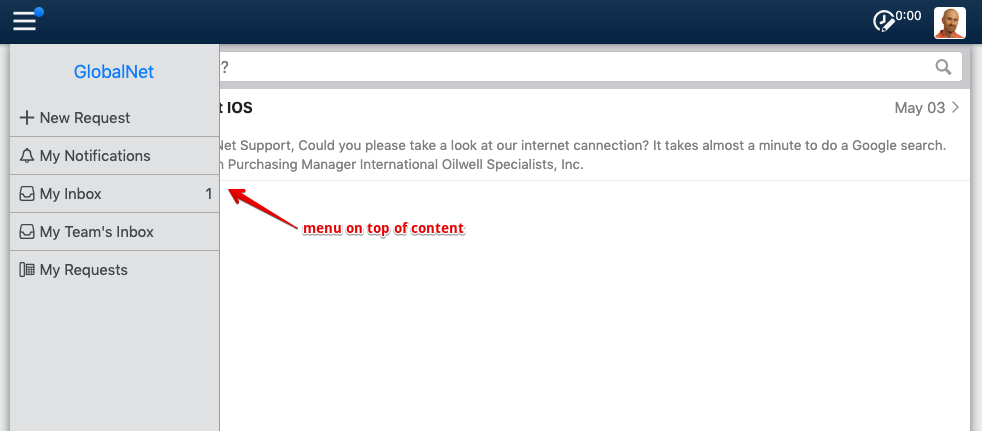
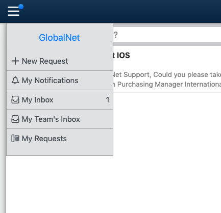
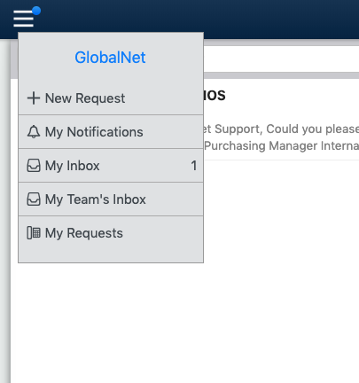

# Exercise 4: Dropdown menu

Revert the Globalnet Design back to the default design:
go to https://globalnet.4me-demo.com/account/self_service_design,
remove all content from each tab, and press Save.

Next, overwrite the following tabs with the content below, and press Save afterwards
(right click and choose "Open Link in New Tab"):

* CSS Tab: [Click here](https://raw.githubusercontent.com/code4me/design-workshop/master/connect-2019/assets/exercise-4/css.scss)
* Homepage HTML Tab: [Click here](https://raw.githubusercontent.com/code4me/design-workshop/master/connect-2019/assets/exercise-4/homepage-html.html)

We will now implement a dropdown menu.
Once again, we only want this on larger screens.
On small screens, the menu should still slide in from the left.

## Positioning

To implement a dropdown menu, you should know a little about *positioning*.
Usually, HTML elements don't overlap each other.
They appear on the screen in the same order in which they appear in the HTML code,
either below or right next to the previous element, the "document flow".

With a dropdown menu, we want to put an element *outside* the normal document flow.
This can be done by *positioning* the element.

You can read more about positioning on https://www.w3schools.com/css/css_positioning.asp.

### Exercise 4.1

Can you use positioning to achieve the following effect when you click the hamburger icon?

### Exercise 4.2

The menu is very high: all the way to the bottom. That doesn't look right for a dropdown menu. 
What CSS property causes this? Change it so that it fits the contents:

### Exercise 4.3

Once more refering to https://www.w3schools.com/css/css_positioning.asp,
can you put the menu a little higher and a little to the right?

### Exercise 4.4

You have probably noticed that on small screens, the page darkens when the menu appears.
This effect is achieved by placing a slightly transparent HTML element over the whole page,
the *backdrop*. This is the HTML element `
`.
It is always on the page, but hidden by default.

Can you make it appear when the menu is open, just like on small screens?

## Optional exercises

If you have time left, give the exercises below a try.

### Exercise 4.5

Log in as howard.tanner@widget.com on https://widget.4me-demo.com and go to
https://widget.4me-demo.com/self-service.
The dropdown menu in this sample design has a nice shadow effect.

Can you find out how it's done and copy it over to the GlobalNet design?

If you like, you can play around with it in the developer tools
to see what other shadow effects you can achieve.
Also note that you use commas to add multiple shadows at the same time.

### Exercise 4.6

Can you make the dropdown menu "fade in" when you click on the hamburger icon?
