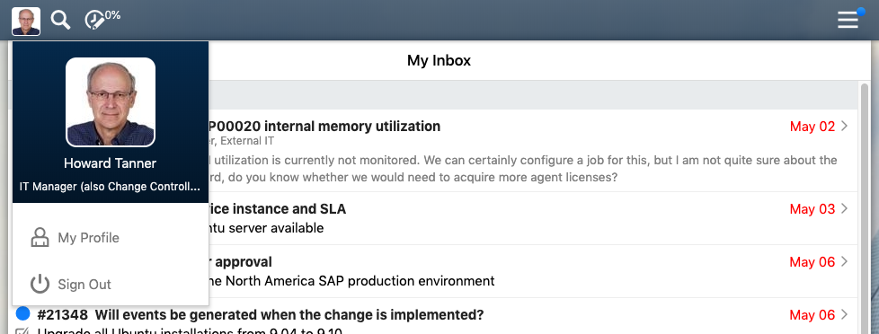

# Advanced exercises

The exercises below are for advanced designers.
You will need a lot of HTML and CSS knowledge to be able to solve them.

However, even if you are unable to solve them just now, 
it may be worth reading through them to get inspiration for your own design.

Before you get started, 
go to https://globalnet.4me-demo.com/account/self_service_design and once again remove all content from all the tabs.   

## Search icon

The search bar on the homepage contains a search icon on the right (a small magnifying glass).

Can you adjust it, so that the icon is visible *only* when the search input field is focused - that is, when the user puts the cursor in the search field?

<details>
  <summary>Click here for a hint</summary>
  Use pseudo-classes and the [sibling combinator](https://developer.mozilla.org/en-US/docs/Web/CSS/General_sibling_combinator).
</details>


## Header icons

The hamburger icon in the header is on the left, and the other header icons are on the right.
Can you swap them?

It should work on all pages of Self Service, not just the homepage.

Once you have done that, can you put the person avatar (which is still right of the search and time entry icons) on the left?

The dropdown menu that appears when you click on the person avatar should appear in the right direction (down and to the right of the person avatar).



Can you put the search and time entry icons on the right, as in the image below?


<details>
  <summary>Click here for a hint</summary>
  You can solve this using various properties related to CSS flexbox layouts.
  Have a look at https://css-tricks.com/snippets/css/a-guide-to-flexbox/.
</details>

## Home

By using the Element Inspector of the developer tools, 
you can see that the global navigation header contains a hidden link back to the homepage 
(on all pages except the homepage).

The link contains the name of the current 4me Account by default.
 
Can you use CSS to change it into a clickable company logo?

## My inbox widget with header

You can add an inbox to the homepage by adding the following HTML to the Homepage HTML field of the Self Service Design:

```
<div class="my-inbox">
  <h1>My inbox</h1>
  {{my_inbox}}
</div>
```

However, when the user's inbox is empty, the header "My inbox" is still displayed.

Can you adjust it, so that the header is visible *only* when there is something in the inbox?


<details>
  <summary>Click here for a hint</summary>
  The widget `{{my_inbox_count}}` might come in handy.
</details>


## My recently used request templates with header (hard)

You can also add "my recently used request templates" to the homepage:

```
<div class="my-recently-used-request-templates">
  <h1>Recently Used Request Templates</h1>
  {{my_recently_used_request_templates}}
</div>
```

As in the previous exercise, the header is displayed, even if the user has not applied any request templates.

Can you adjust it, so that the header is visible *only* when there are any request templates?

<details>
  <summary>Click here for a hint</summary>
  Use CSS flexbox layout and the [sibling combinator](https://developer.mozilla.org/en-US/docs/Web/CSS/General_sibling_combinator).
</details>

## Summary and details (hard)

Suppose you want to add a number of widgets to the homepage, that are by default *collapsed*.
That is, initially you see only the header - "My inbox", "My requests", and so on.
When you click on the header, the widget expands and shows the list of items.

There is a useful HTML element that you can use for this, the [`<details>`](https://developer.mozilla.org/en-US/docs/Web/HTML/Element/details) element:

```
<details class="my-inbox">
  <summary>My inbox</summary>
  {{my_inbox}}
</details>
```

Unfortunately, however, this is not supported in Internet Explorer.

Can you think of a way to implement this functionality in such a way, that it also works in Internet Explorer?

<details>
  <summary>Click here for a hint</summary>
  Use a hidden checkbox and the [sibling combinator](https://developer.mozilla.org/en-US/docs/Web/CSS/General_sibling_combinator).
</details>
