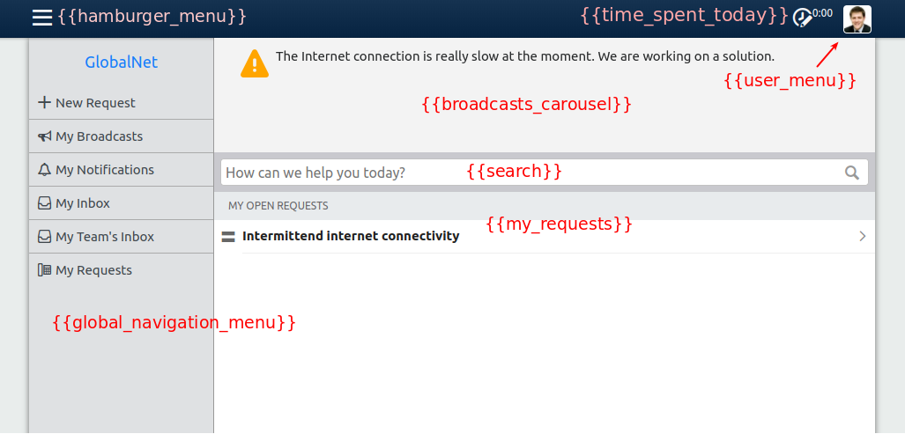

# The structure of Self Service

For the purposes of design, the pages on Self Service can be divided in two groups:

* The *Homepage*: this page can be fully customized. You can replace both the HTML and CSS with your own.
* All the other pages, such as the My Requests page and the pages of the New Request wizard. 
  On these pages you can also fully customize the CSS, but you cannot change the HTML.
  
## The Self Service Design Form

Have a look at the Self Service Design form at https://globalnet.4me-demo.com/account/self_service_design.

The form contains the following tabs:

* CSS
* Homepage HTML
* Homepage CSS
* Global Navigation HTML

Together, these 4 tabs can be used to customize both the homepage and the other pages of Self Service. They work together as described below.

## Homepage

### HTML

The HTML of the Self Service homepage is built up as follows:

```
<html>
  <head>
    Inserted by 4me
  </head>
  <body>
    Value of the Homepage HTML tab
  </body>
</html>
```

That means that, apart from the `head` part of the HTML 
(which is not shown by the browser, but contains information about the page), you can create any HTML you like.

It is possible to include _widgets_ on the homepage by adding `{{name of the widget}}` at the desired location in the Homepage HTML. 
Widgets are standard components offered by 4me that can be used to display dynamic content (e.g., content that depends on the currently logged in user).

When a user visits Self Service, the widgets will be replaced by HTML.

`{{brand}}` is an example of a widget. For GlobalNet, this widget renders the following HTML:

```
<html>
<div class="widget-brand">
  <a class="brand" href="/self-service">GlobalNet</a>
</div>
</html>
```

When you put the cursor in the Homepage HTML tab and type `{{` a list of available widgets appears.

The out-of-the-box design contains the following widgets:



### CSS

The CSS of the homepage is built up as follows:

1. CSS of Bootstrap
2. Standard 4me CSS, used to style standard widgets that may occur on the homepage, such as the search bar and the user menu.
3. CSS of the _CSS_ tab of the Self Service Design
4. CSS of the _Homepage CSS_ tab of the Self Service Design

## Other Self Service pages

### HTML

It is not possible to customize the HTML of the other Self Service pages, with the exception of the _global navigation menu_. 
This is the menu that is displayed when you click on the hamburger menu icon in the top left corner. 
By default, it contains only the following widgets:

* `{{brand}}`: the Account name, linking to the Self Service homepage
* `{{navigation_menu}}`: a list of links to all the pages of Self Service

You can adjust the Global Navigation HTML tab of the Self Service Design to also include other elements, such as your own custom links.

The global navigation menu can also be included on the homepage. 
If you add the `{{global_navigation_menu}}` widget to the Homepage HTML tab, 
the HTML of the Global Navigation HTML tab is inserted at the appropriate location.

### CSS

The CSS of the other Self Service pages is built up as follows:

1. CSS of Bootstrap
2. Standard 4me CSS
3. CSS of the _CSS_ tab of the Self Service Design

As you can see, the CSS tab of the Self Service Design is injected both on the homepage and on all the other pages. 
You should use it to customize components that occur on both, such as the Global Navigation Menu.

## Mobile devices

When you log in on the 4me Mobile App, the same Self Service Design is shown as on a desktop. 
That means you have to make sure that the same design looks good both on desktop and on mobile devices.
